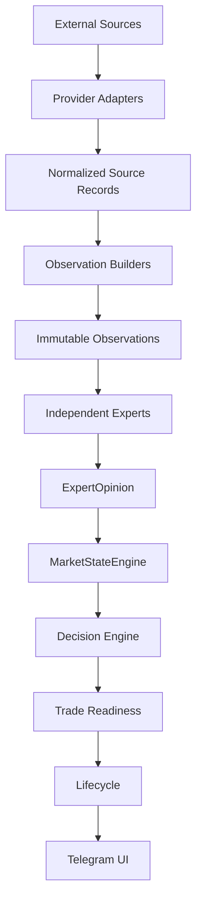

# WR-027C — Legacy to Intelligence Migration Map

## Status and scope

Architecture proposal for review. This document maps the working Hostinger
production baseline reported at `d2182d2` (`v20.4 track changes between live
analyses`) to the provider-neutral intelligence foundation available in the
repository after `v0.8-first-expert`.

This task changes no runtime code, service, dependency, database, deployment,
provider integration, or Telegram behavior. Production remains authoritative
until each replacement has passed explicit parity gates. The untracked WR-026C
work is outside this map and is not treated as an implemented capability.

## Current-state boundary

There are two materially different architectures:

```text
Production alert path

Arkham webhook
  -> legacy filtering, persistence, scoring and clustering
  -> legacy intelligence orchestration
  -> alert decision and prediction persistence
  -> Telegram

Intended live-analysis path

Arkham history + Funding + OI + Price
  -> Market Snapshot
  -> Evidence Facts and Evidence Graph
  -> Decision Engine v2
  -> Trade Readiness
  -> Lifecycle/change tracking
  -> Telegram
```

The intended `/analyze` path is not reproducible from tracked Git at production
commit `d2182d2`: `app/decision/decision_engine.py`,
`app/decision/facts.py`, `app/intelligence/snapshot_builder.py`, and
`app/intelligence/market_snapshot.py` are imported but absent. Hostinger parity
and runtime identity must therefore be established before implementation or
deployment. The new Observation/Expert/MarketState packages are not integrated
into either production path.

## Target architecture



The arrows are ownership boundaries, not permission for a lower layer to call
upward. Provider health, freshness, provenance, and missing-data state travel
with normalized inputs. Missing is never silently converted to neutral.

## Permanent design rules

1. Experts consume immutable Observations and must never import or call
   provider adapters, HTTP clients, repositories, Telegram, or each other.
2. Decision Engine consumes `MarketState` plus explicit risk/context inputs. It
   does not fetch sources or calculate raw market facts.
3. Trade Readiness sits above MarketStateEngine and the Decision Engine. It
   converts an intelligence-backed decision into operational readiness; it
   does not replace market interpretation.
4. Lifecycle is a post-decision management and evaluation layer. It tracks
   entry/target/stop progress and outcomes; it must not infer the market state
   that justified the original decision.
5. Telegram is presentation and command orchestration only. Formatters do not
   calculate confidence, direction, readiness, or risk.
6. Legacy components may run temporarily as unchanged control or shadow paths.
   Shadow output must have no production influence unless separately approved.
7. Migration is incremental. Old behavior remains available until the new path
   has deterministic tests, live shadow evidence, operational health, rollback,
   and Architecture Review approval.
8. One fact has one semantic owner. Cross-provider duplicates are normalized
   before Observations; Expert evidence is not counted again in Decision.
9. No component is deleted merely because its future destination is marked
   `Deprecated`. Deletion requires measured parity and a separate task.

## Component destination map

### Sources, snapshots, facts, and evidence

| Current filename/component | Current responsibility | Current inputs | Current outputs | Production importance | Future destination |
| --- | --- | --- | --- | --- | --- |
| `app/main.py::arkham_webhook` | Authenticates and accepts Arkham push payloads; invokes the legacy pipeline | HTTP headers and JSON payload | HTTP result; pipeline side effects | Critical alert ingress | Source Adapter boundary/transport endpoint |
| `app/sources/manager.py`, `app/sources/arkham.py` | Selects Arkham parser and classifies exchange inflow/outflow | Arkham-like payload dictionary | `MarketEvent` | Critical | Source Adapter |
| `app/sources/arkham_parser.py` | Alternate alias-normalizing parser, not registered in the live manager | Arkham-like payload | `MarketEvent` | Low/currently unused | Deprecated after canonical OnChain adapter exists |
| Funding snapshot services in `app/services/*perpetual_funding_snapshot.py` | Fetch and normalize venue-specific funding, history, mark/index and basis | asset, history limit, timeout | venue dictionaries | Read-only command support; not alert-critical | Source Adapter |
| `app/services/unified_funding_hub.py` | Aggregates OKX/Binance/Gate/Bybit and computes consensus/divergence | asset | cross-exchange funding snapshot | Valuable read-only production capability | Observation Builder, split from transport |
| `app/services/unified_open_interest_hub.py` | Aggregates current venue OI and concentration | asset | cross-exchange OI snapshot | Intended analysis input; no direct `/oi` command | Observation Builder, split from transport |
| Missing `app/intelligence/snapshot_builder.py` | Intended orchestration of Arkham, funding, OI and price into one synchronized snapshot | asset and recent event | missing `MarketSnapshot` | Required by `/analyze`, unavailable in tracked Git | Requires redesign into source coordination + domain builders |
| Missing `app/intelligence/market_snapshot.py` | Intended aggregate snapshot and quality model | source blocks | snapshot/quality value object | Required by `/analyze`, unavailable in tracked Git | Requires redesign as normalized source-record bundle; not an Expert input itself |
| `app/intelligence/snapshot_fact_builder.py` | Converts snapshot blocks into Arkham/funding/OI/price facts | missing `MarketSnapshot` | missing `MarketFact[]` | Intended `/analyze`; import-incomplete | Observation Builder |
| Missing `app/decision/facts.py` | Intended normalized fact contract | source-normalized values | `MarketFact` | Required by evidence path, absent | Observation Contract; replace only after schema comparison |
| `app/decision/evidence/fact_mapper.py` | Weights facts and creates evidence nodes | `MarketFact[]` | `EvidenceNode[]` | Intended `/analyze`; import-incomplete | Requires redesign; mapping logic moves to Expert-local evidence policy |
| `app/decision/evidence/node.py`, `edge.py`, `graph.py`, `graph_builder.py` | Builds a complete graph of support/contradiction from directional facts | evidence nodes | explanatory graph | Intended `/analyze`; not alert path | Expert-internal evidence support and optional Decision explanation; not an Observation layer |
| `app/engine/context.py` | Holds process-local Arkham events and derives clusters | `MarketEvent` | cluster count/value/window | Critical alert input | Observation Builder with durable/time-aware source records |
| `app/engine/context_stats.py`, `exchange_stats.py`, `pressure.py`, `similar_events.py` | Queries historical event aggregates and analogues | asset/entity/direction/window | statistics dictionaries | Critical through legacy intelligence | Observation Builder |
| `app/engine/wallet_profile.py`, `wallet_memory.py`, `event_memory.py`, `campaign_detector.py` | Builds wallet/event/campaign history | entity/event/window | historical dictionaries | Critical through legacy intelligence | Observation Builder |

### Interpretation, decision, readiness, and lifecycle

| Current filename/component | Current responsibility | Current inputs | Current outputs | Production importance | Future destination |
| --- | --- | --- | --- | --- | --- |
| `app/engine/scorer.py` | Heuristic Arkham size/asset/exchange direction score | `MarketEvent` | score, direction, confidence, reasons | Critical alert gate | OnChain Expert, then Deprecated after parity |
| `app/engine/wallet_intelligence.py`, `wallet_behaviour.py`, `wallet_ranking.py` | Interprets wallet history and behavior | wallet profiles/history/direction | reliability, behavior, rank | Critical through legacy intelligence | Wallet Expert |
| `app/engine/market_regime.py`, `market_heat.py`, `opinion.py` | Interprets legacy context into regime/heat/opinion | direction, cluster, pressure, wallet inputs | regime/heat/opinion dictionaries | Critical | Experts + MarketStateEngine; Requires redesign |
| `app/engine/institutional_score.py`, `institutional_confidence.py` | Aggregates institutional evidence into score/confidence | legacy component dictionaries | bounded score/confidence | Critical | MarketStateEngine quality/confidence policy; Requires redesign |
| `app/engine/probability_engine.py`, `risk_engine.py`, `scenario_engine.py` | Calculates directional probability, risk and scenarios | legacy scores/context | probability/risk/scenario dictionaries | Critical | Decision Layer |
| `app/engine/decision_engine.py` | Builds legacy final AI decision | probability, risk, campaign, memory, wallet, scenarios | decision dictionary/text | Critical legacy alert | Decision Layer; retain as control during shadow comparison |
| Missing `app/decision/decision_engine.py` | Intended Decision Engine v2 used by `/analyze` | intended market facts | intended decision result | Not reproducible | Requires redesign against `MarketState` contract |
| `app/decision/trade_readiness_engine.py`, `trade_decision.py` | Applies quality, stability and confirmation caps; emits readiness stage/action/risk | Decision v2 dictionary and snapshot quality | `TradeDecision` | Intended `/analyze`; import-incomplete | Decision Layer above MarketStateEngine |
| `app/engine/entry_planner.py`, `price_planner.py`, `target_projection.py`, `adaptive_target.py` | Produces entry guidance, stop/targets and ETA | direction, spot price, probabilities/risks | execution guidance dictionaries | Critical legacy alert content | Decision Layer |
| `app/engine/alert_priority.py`, `alert_filter.py` | Classifies and gates notification delivery | signal rating/priority | send decision and reason | Critical | Decision Layer notification policy |
| `app/engine/outcome_engine.py` | Persists predictions and evaluates open outcomes | generated decision/target or stored rows | SQLite changes/evaluation results | Critical for prediction save; conditional for evaluation | Lifecycle Layer |
| `app/services/prediction_lifecycle_builder.py` | Reconstructs extrema, target/stop touch and progress from OHLC | prediction, candles, optional stop | `PredictionLifecycle` | Shadow/review path | Lifecycle Layer |
| `app/services/prediction_review_service.py`, `app/engine/outcome_intelligence.py` | Fetches candle history and evaluates lifecycle quality | prediction ID/record and candles | review/outcome v1/v2 | Telegram review, shadow learning | Lifecycle Layer |
| Adaptive/meta/pattern/context learning engines | Adds historical confidence, calibration and recommendation overlays | stored outcomes/context and legacy decisions | shadow comparisons/recommendations | Eager in parts of alert orchestration or command-only | Requires redesign; Decision Layer learning, never raw observation |
| `app/intelligence/experts/trend/*` | Pure deterministic interpretation of normalized trend/structure observations | immutable observations | `ExpertOpinion` | Not production-integrated | Expert |
| `app/intelligence/market_state/*` | Synthesizes opinions into market state | `ExpertOpinion[]` | `MarketState` | Not production-integrated | MarketStateEngine |

### Persistence, orchestration, and UI

| Current filename/component | Current responsibility | Current inputs | Current outputs | Production importance | Future destination |
| --- | --- | --- | --- | --- | --- |
| `app/engine/pipeline.py` | Orchestrates the entire Arkham alert path and its side effects | `MarketEvent` | status dictionary, persistence, Telegram send | Highest | Requires redesign into thin application orchestration; migrate last |
| `app/services/analyze_service.py` | Intended live-analysis orchestration and change tracking | asset | snapshot/facts/evidence/decision/trade dictionary | Telegram `/analyze`; import-incomplete | Requires redesign into application service over Source/Observation/Expert/Decision boundaries |
| `app/repository/analysis_state_repository.py` | Stores latest per-asset analysis state | trade dictionary and snapshot ID | previous/current analysis state | Intended `/analyze` | Lifecycle Layer persistence |
| `app/repository/prediction_repository.py` | Reads predictions | ID/status/limit | `Prediction` objects | Review/outcome commands | Lifecycle Layer persistence |
| `app/repository/prediction_context_repository.py` | Persists historical context | context/filter | context records | Shadow learning | Observation history repository |
| `app/repository/learning_recommendation_repository.py` | Persists learning recommendations | recommendation/filter | recommendation records | Shadow learning | Decision Layer learning repository |
| `app/telegram/compact_formatter.py`, `formatter.py` | Formats webhook alert and details | event/legacy intelligence | HTML | Critical | UI Layer |
| `app/telegram/analyze_formatter.py` | Formats readiness/evidence/change | analysis result | escaped HTML | Intended `/analyze` | UI Layer |
| `app/telegram/sender.py` | Sends Bot API messages | HTML and configured destination | send result | Critical | UI Layer transport |
| `app/telegram/polling_bot.py` | Registers commands and invokes services/formatters | Telegram updates and args | Telegram replies | Critical polling process | UI Layer application adapter |
| Dashboard/health/calibration formatters and engines | Produces operational views | stored engine statistics | HTML/text reports | Command-only | UI Layer |

## Required migration table

| Legacy Component | Current Role | Future Component | Migration Difficulty | Risk |
| --- | --- | --- | --- | --- |
| Arkham webhook | Production push ingress | Authenticated OnChain Source Adapter ingress | Medium | Payload variants, replay, secret rotation, event-time drift |
| Arkham adapter | Payload parsing and exchange-flow classification | Provider adapter emitting normalized transfer records | Medium | Alias/entity mismatch and changed alert volume |
| Funding adapters | Venue HTTP fetching and partial normalization | Provider-specific Derivatives Source Adapters | Medium | Schema/rate changes, unit/time mismatches |
| Funding hub | Multi-venue aggregation and interpretation | Derivatives Observation Builder; interpretation moves to Expert | High | Mixing transport, aggregation and directional semantics |
| Open Interest hub | Current OI aggregation/concentration | Derivatives Observation Builder | High | No delta/history; false direction if magnitude is misread |
| Snapshot Builder | Intended all-source orchestration | Source coordinator plus independent Observation Builders | High | Missing tracked implementation; deployed behavior unknown |
| Market Snapshot | Intended synchronized blocks and quality | Typed source-record bundle/freshness envelope | High | Missing schema and unknown host implementation |
| Evidence Facts | Intended normalized market facts | Immutable domain Observations | High | Absent contract; semantic mismatch and double counting |
| Evidence Graph | Universal support/contradiction graph | Expert-local evidence plus optional decision explanation graph | High | Cross-domain edges can invent agreement and obscure ownership |
| Decision Engine | Legacy final decision and absent v2 variant | Decision Engine consuming `MarketState` | Very high | Direct alert behavior, incompatible schemas, unknown v2 code |
| Trade Readiness | Confirmation/safety caps and action stage | Readiness policy above intelligence-backed Decision Engine | Medium | Stage/threshold changes can alter user action timing |
| Lifecycle | Prediction/outcome progress | Lifecycle management/evaluation layer | Medium | Historical schema, candle gaps, target/stop semantics |
| Prediction Review | Candle-backed outcome and learning review | Lifecycle review application service | Low–medium | External candle availability and historical comparability |
| Telegram formatter | Presentation of legacy/analyze results | UI-only formatter over stable view models | Medium | User-visible omissions, HTML limits and terminology drift |
| Database repositories | Events, predictions, contexts, recommendations, analysis state | Layer-owned repositories with explicit migrations | Very high | Data loss, schema drift, locking and rollback complexity |
| Legacy pipeline | Monolithic production orchestration | Thin application workflow across architectural boundaries | Very high | Highest blast radius; migrate last |

## Special review decisions

### Arkham

Current acquisition is webhook-only. The canonical destination is:

```text
Arkham webhook transport
  -> OnChain Source Adapter
  -> normalized TransferSourceRecord
  -> OnChainFlowObservation Builder
  -> OnChainFlowObservation
  -> OnChainFlow Expert
  -> ExpertOpinion
```

The first migration preserves existing filtering and alert behavior as a
control. Normalization must add event time, chain-qualified transaction
identity, explicit entity-label provenance, freshness, and missing/error state.
The Expert may interpret confirmed exchange flow but must not infer wallet
intent from a transfer alone.

### Funding

The four read-only venue clients are valuable and should be retained behind
provider adapters. `UnifiedFundingHubService` currently combines acquisition,
normalization, source selection, aggregation and semantic labels. Split it:

```text
venue funding records
  -> Derivatives Observation Builder
  -> DerivativesObservation(funding, basis, dispersion, freshness, quality)
  -> Derivatives Expert
```

Native venue data remains authoritative for its own market and timestamp.
Consensus is an observation fact; crowding/squeeze interpretation belongs to
the Expert.

### Open Interest

The OI hub provides current cross-exchange magnitude and concentration but no
historical delta. Its first Observation must remain non-directional. Directional
interpretation is permitted only after a deterministic, time-aligned OI delta
builder exists. Funding and OI may share `DerivativesObservation` when their
timestamps, instruments, units, freshness and provenance remain individually
visible.

### Evidence Graph

Do **not** create an `EvidenceObservation` layer. An Observation represents a
normalized market fact, while support/contradiction is interpretation. A
universal pairwise graph also risks relating facts from different semantics
merely because both carry a direction.

Reusable evidence primitives may support internal Expert reasoning, with each
Expert owning its relation policy. A separate optional explanation graph may be
built in the Decision Layer from `ExpertOpinion` and `MarketState`, but it must
not feed the same evidence back as a new independent signal.

### Trade Readiness

Trade Readiness remains above MarketStateEngine:

```text
Observations -> Experts -> MarketStateEngine
  -> Decision Engine -> Trade Readiness -> Lifecycle/UI
```

It consumes direction, confidence/stability, risk and explicit confirmations
from intelligence-backed decisions. It may cap ACTION when operational evidence
is missing, but it must not calculate trend, crowding, wallet behavior, or raw
market facts.

## Migration phases and rollback

| Phase | Objective | Components involved | Primary risk | Rollback possibility |
| --- | --- | --- | --- | --- |
| **0 — Production preservation** | Freeze and observe the live `d2182d2` behavior; no deploys while parity is unknown | Hostinger processes, webhook, database, Telegram, service configuration | Accidental operational change or loss of baseline | Full: no runtime changes are made |
| **1 — Repository parity and reproducibility** | Identify exact deployed files, Python/dependencies, entry points, schemas and process definitions; restore a testable Git representation through separate review | Host filesystem inventory, Git tree, missing snapshot/fact/decision modules, tests | Copying secrets/runtime artifacts or assuming which copy is authoritative | High: inventory is read-only; code restoration remains feature-branch only |
| **2 — Source normalization** | Put Arkham and native exchange access behind typed provider-neutral source records with health/freshness/provenance | webhook adapter, funding/OI/price/candle clients, source contracts | Changed parsing, time/unit identity, rate/failure behavior | High: legacy pipeline continues consuming old path; new records shadow only |
| **3 — Observation migration** | Build immutable on-chain and derivatives observations without interpretation | source records, builders, observation contracts, fixtures | Missing vs neutral confusion; double counting; inaccurate OI delta | High: compare observations to legacy facts, no decision influence |
| **4 — Expert migration** | Move domain interpretation into independent Experts | Trend, Derivatives, OnChainFlow, Wallet, later Liquidity experts; MarketStateEngine | Score/direction drift and duplicated legacy evidence | High: Expert opinions and MarketState recorded only in shadow |
| **5 — Shadow decision comparison** | Run new MarketState → Decision → Readiness beside legacy decisions and measure parity/disagreement | future Decision Engine, readiness adapter, comparison storage, UI preview | Misleading comparisons, latency, incomplete confirmation semantics | Immediate: disable shadow runner/display; legacy remains authoritative |
| **6 — Production intelligence rollout** | Gradually make reviewed new intelligence authoritative with monitoring and rollback | application pipeline, decision/readiness, lifecycle, Telegram view models | Alert volume/content regression, outage, database migration failure | Required: feature flag/canary and one-step switch to legacy path |

## Phase gates

No phase advances solely because code exists. Minimum gates are:

- Phase 0 → 1: approved read-only Hostinger audit window.
- Phase 1 → 2: deployed tree, process, Python, dependencies and schema are
  reproducible from a reviewed commit without secrets.
- Phase 2 → 3: deterministic provider fixtures, freshness/error behavior and
  cross-provider identity tests pass.
- Phase 3 → 4: observation completeness and missing/neutral semantics are
  accepted for representative assets and outages.
- Phase 4 → 5: Expert unit tests and MarketState invariants pass; no provider or
  persistence imports exist in Experts.
- Phase 5 → 6: an approved observation period shows acceptable disagreement,
  latency, alert volume, data health and rollback rehearsal.
- Phase 6: separate Architecture Review and explicit deployment authorization.

## Production preservation and compatibility

- The Arkham webhook/pipeline/Telegram chain remains unchanged until Phase 6.
- Read-only `/funding` and lifecycle/review capabilities are preserved even if
  their internals are later normalized.
- Database changes use forward migrations and backups; no destructive schema
  operation is part of this map.
- New outputs receive explicit contract/policy versions so stored historical
  decisions remain interpretable.
- Shadow records are labeled and cannot trigger Telegram alerts or execution.
- Failure of a new provider or Expert falls back to the unchanged legacy path,
  not to a fabricated neutral signal.

## Unresolved architecture questions

1. Which exact files and process environment make `/analyze` importable on
   Hostinger at `d2182d2`?
2. What are the deployed Python version, dependency set, service entry points,
   working directory, and database schema/migration history?
3. Is the absent Decision Engine v2 authoritative on the host, in an unmerged
   branch, or obsolete?
4. What observation period and numerical tolerances define acceptable parity
   for direction, confidence, readiness stage, alert volume, and latency?
5. Which legacy adaptive/meta modules are intended product behavior versus
   experimental shadow output?
6. Should Decision explanation retain a graph representation, or is a typed
   reason/provenance list sufficient?
7. Which source histories must be persisted to build deterministic OI, price
   and funding deltas, and what are their retention/licensing limits?
8. What feature-flag and rollback mechanism is available in the current
   Hostinger process model?

No answer is assumed by this task.
