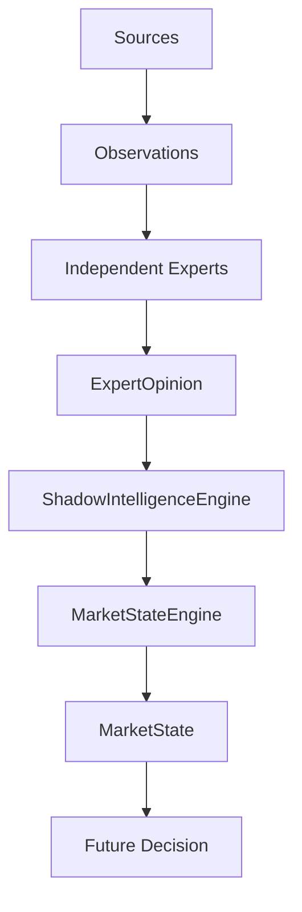
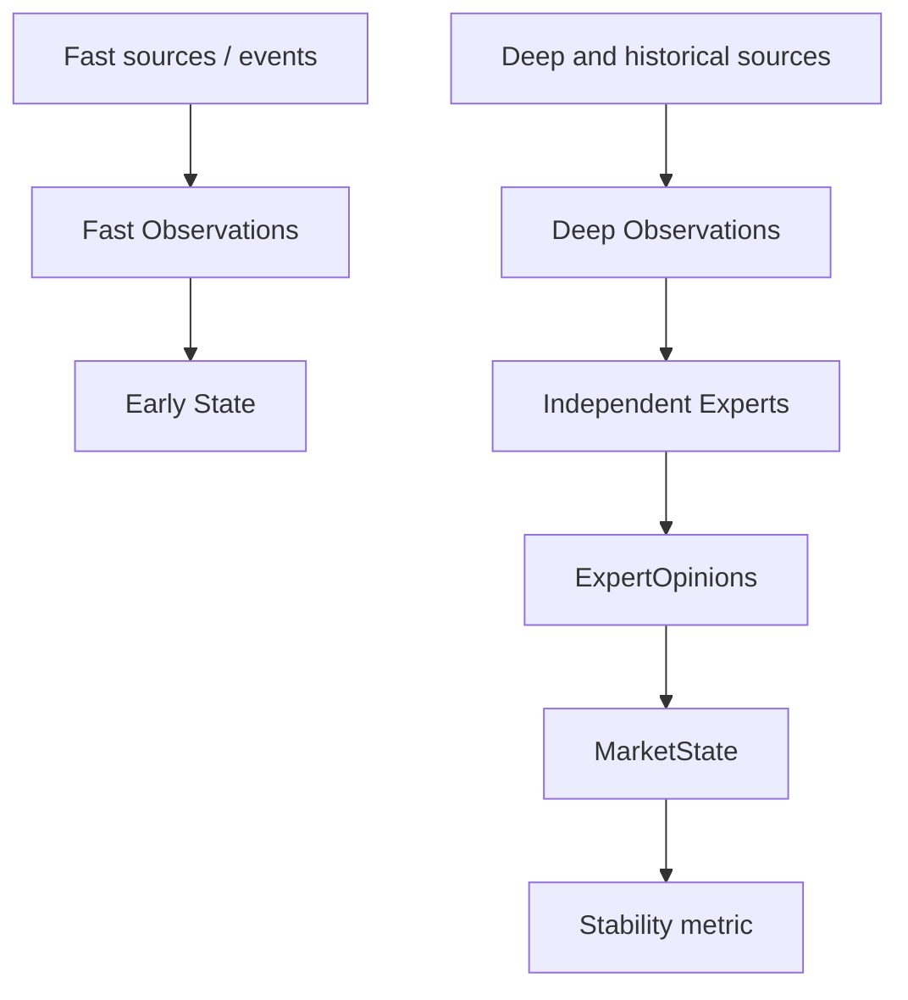
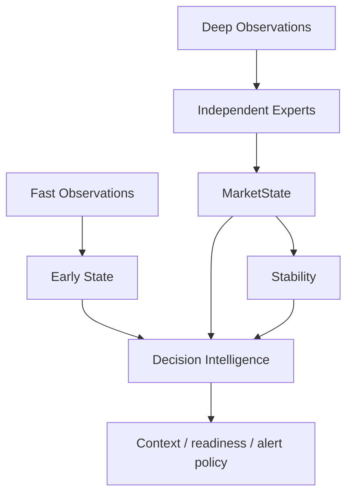

# WR-031 Intelligence Timing Architecture

## Status

Proposed — pending Architecture Review.

## Context

Whale Radar AI now has immutable `ExpertOpinion` contracts, independent Legacy
and Trend expert sources, `ShadowIntelligenceEngine`, and
`MarketStateEngine`. These components establish interpretation and synthesis
boundaries, but they do not yet define when intelligence should become
available.

A single timing path creates an avoidable trade-off. Waiting for every source
can miss the beginning of a move; treating the first event as a complete
decision creates false certainty. The architecture therefore separates early
detection from deeper confirmation while allowing a future Decision Layer to
use both.

This document defines timing semantics only. It does not implement runtime
code, a Decision Stability Engine, production integration, alerts, execution,
or provider access.

## Decision

Adopt two complementary intelligence horizons:

1. **Fast Intelligence** detects emerging facts with low latency and produces
   an early, explicitly incomplete view.
2. **Deep Intelligence** evaluates normalized evidence through independent
   Experts and synthesizes a contextual `MarketState` with confidence and
   stability metrics.

Neither horizon replaces the other. A future Decision Layer consumes both and
retains their timestamps, provenance, freshness, disagreements, and missing
confirmations.

## Fast Intelligence

### Purpose

Fast Intelligence exists to:

- detect emerging market events;
- avoid missing the early phase of a material move;
- provide immediate directional or structural context;
- make latency and incompleteness explicit.

### Characteristics

- lower latency and a small dependency set;
- event-driven or short-window processing;
- accepts incomplete but valid normalized information;
- distinguishes missing evidence from neutral evidence;
- may create early observations and an `EarlyState` in a future contract;
- has no final confidence, consensus, readiness, or execution authority.

Typical inputs include:

- price breakout;
- break or change of market structure;
- volume expansion;
- liquidity event;
- momentum shift.

Fast Intelligence reports what was detected and how fresh/reliable the source
fact is. It does not claim that a scenario is confirmed merely because it was
detected first.

### Early State semantics

`EarlyState` is a future conceptual output, not a contract introduced by
WR-031. It should identify the event class, tentative direction, observation
time, freshness, source quality, provenance, and missing context. It must not
reuse `MarketState` in a way that implies deep synthesis has already occurred.

## Deep Intelligence

### Purpose

Deep Intelligence exists to:

- evaluate the broader market scenario;
- compare independent evidence axes;
- synthesize expert opinions;
- measure confidence, quality, agreement, conflict, and stability;
- explain what confirms or challenges an early event.

### Characteristics

- slower than the fast path because it waits for a defined evaluation window
  or multiple normalized inputs;
- multi-source and multi-expert;
- higher context and stronger provenance requirements;
- tolerates unavailable experts without converting missing data to neutral;
- produces synthesis, not execution instructions.

Current and planned expert contributors include:

- Legacy Intelligence Expert;
- Trend Expert;
- future Funding Expert;
- future Arkham/on-chain Expert;
- future Open Interest Expert.

Experts remain independent. They consume only their approved normalized inputs,
do not call one another, and emit individual `ExpertOpinion` values. The
`MarketStateEngine` remains the synthesis authority.

## Timing and authority boundaries

| Concern | Fast Intelligence | Deep Intelligence | Future Decision Layer |
| --- | --- | --- | --- |
| Primary goal | detect | interpret and synthesize | choose response/context |
| Typical latency | event/short window | evaluation window | after relevant inputs |
| Incomplete input | expected and explicit | tolerated as missing | considered in policy |
| Output | early observations / future EarlyState | ExpertOpinions / MarketState | Decision Intelligence |
| Confidence authority | no | synthesis-level metric | policy consumer |
| Entry/execution authority | no | no | separately governed |

No fixed milliseconds or candle counts are defined here. Latency budgets and
evaluation windows are domain-specific policy that require measurement before
implementation.

## Architecture rules

1. The fast layer may create early observations from valid source facts.
2. The deep layer creates independent expert opinions and expert synthesis.
3. Decision Stability is a confidence/consensus metric, not an entry blocker.
4. Missing deep confirmation lowers or qualifies confidence; it does not
   retroactively invalidate a valid early detection.
5. Experts remain independent and must not call or rewrite one another.
6. A future Decision Layer consumes both early and deep intelligence.
7. Fast evidence must never be relabelled as deep confirmation.
8. Deep disagreement must remain visible rather than being hidden by a binary
   accept/reject gate.
9. Every output retains event time, evaluation time, freshness and provenance.
10. Neither layer creates orders, entries, targets, stops or execution signals.

## Data flow

### Current conceptual flow

The current intelligence foundation operates only in shadow architecture and
is not connected to the production pipeline.

### Future separated timing flow

`Early State` and a dedicated stability component are future concepts. This
document authorizes neither implementation.

### Combined Decision Intelligence flow

Decision Intelligence receives both paths without forcing either to impersonate
the other. Its future policy decides how freshness, conflict, risk, readiness,
and user-facing context interact.

## Decision Stability role

Decision Stability measures how robust a synthesized conclusion is to expert
agreement, evidence quality, confidence, freshness, and potentially temporal
change. It answers: “How stable is the present conclusion?” It does not answer:
“May a trade be entered?”

Consequently:

- low stability qualifies uncertainty but does not erase an early event;
- high stability increases trust in synthesis but does not guarantee outcome;
- stability must not be a hard universal entry gate;
- thresholds belong to future Decision/Trade Readiness policy, not to Experts;
- the existing `MarketState.decision_stability` remains a provisional
  synthesis metric, not a standalone Decision Stability Engine;
- WR-031 does not create or change a stability formula.

## Trading considerations

These scenarios describe intelligence behavior, not trading instructions.

### Scenario 1 — fast bullish breakout, deep confirmation missing

Fast observations detect a valid bullish breakout. Deep inputs have not arrived
or do not yet satisfy their evaluation window.

Expected behavior:

- an early informational alert may be allowed by future alert policy;
- the event remains marked early/unconfirmed;
- confidence and stability remain lower or unavailable;
- missing confirmation is listed explicitly;
- the system does not manufacture neutral or bullish expert votes.

### Scenario 2 — fast and deep intelligence agree

Fast observations detect a bullish move, and independent deep Experts later
support the same direction and scenario.

Expected behavior:

- the early event remains linked to its original timestamp and provenance;
- deep synthesis raises contextual confidence and likely stability;
- reasons identify which experts confirm the scenario;
- agreement still does not guarantee profit or automatically authorize entry.

### Scenario 3 — fast bullish, deep bearish

Fast observations detect a bullish event while deeper evidence favors a bearish
scenario or identifies a reversal/correction conflict.

Expected behavior:

- represent a conflict state, not automatic rejection of either path;
- preserve both directions, timestamps, quality and reasons;
- lower confidence/stability or add explicit conflict warnings;
- allow future Decision policy to distinguish a short-lived breakout,
  correction, reversal attempt, or stale deep context;
- do not silently overwrite the early event with the later synthesis.

## Migration impact

### Legacy Intelligence Expert

Legacy Intelligence remains one broad deep opinion in shadow mode. Its internal
fast and slow legacy computations are not split by this document. During future
migration, any low-latency facts it currently bundles should become normalized
fast observations before the remaining contextual result is treated as a deep
opinion. It must not be presented as ground truth or final decision authority.

### Trend Expert

The Trend Expert remains a deep expert that consumes normalized trend and
structure observations. A structure break may also feed the fast path as an
early observation, but the early event and the Trend Expert opinion are
separate artifacts with separate semantics. The same underlying event must not
be double-counted as two independent confirmations.

### Future Funding Expert

Funding normally belongs to deep derivatives context because it needs venue,
history, dispersion and crowding interpretation. A rapid funding dislocation
may create a fast observation, but the Funding Expert independently determines
its contextual meaning and confidence later.

### Future Arkham Expert

A large verified transfer may create a fast on-chain observation. Entity,
directional-flow, history, deduplication and source-agreement analysis belong to
the future deep Arkham/on-chain Expert. Transfer detection alone must not be
translated into wallet intent or a trading decision.

### Future Open Interest Expert

A sharp OI change may be detected quickly. Deep interpretation requires price,
funding, venue distribution, liquidation context and historical comparison.
Missing OI history is missing evidence, not a neutral expert opinion.

### MarketStateEngine

`MarketStateEngine` remains a deep synthesis authority over completed
`ExpertOpinion` values. It does not ingest raw fast events, wait for providers,
or decide alert timing. A future Decision Layer may compare an `EarlyState`
with `MarketState`; this does not require the engine to merge both contracts.

### Trade Readiness

Trade Readiness consumes the presence, quality, conflict and freshness of both
horizons through future Decision policy. Missing deep confirmation may lower
readiness or identify missing confirmations, but must not universally block an
early alert. Readiness remains distinct from detection, confidence, stability,
and execution authorization.

## Failure and freshness semantics

- Missing: expected evidence has not arrived or is unavailable.
- Neutral: valid evidence exists and has no material directional bias.
- Stale: evidence exists but is outside its fresh window.
- Conflict: valid evidence axes materially disagree.
- Unconfirmed: an early event exists without sufficient deep context.

These states must remain distinct. Timeouts should produce missing/stale
metadata rather than synthetic neutral opinions. Deep results arriving later
augment the intelligence timeline; they do not rewrite the recorded early
event.

## Observability and audit requirements

A future implementation should record correlation ID, asset, timeframe, event
time, receive time, evaluation time, layer (`FAST` or `DEEP`), source/expert
provenance, quality, freshness, missing inputs, and conflict warnings. Logs and
metadata must not contain secrets or raw authenticated provider payloads.

Evaluation metrics should include detection latency, deep-confirmation latency,
false early-event rate, expert agreement, state transitions, staleness, and
outcome-independent calibration. These metrics are required before choosing
production thresholds.

## Alternatives considered

### Wait for all deep confirmation before any output

Rejected because it can hide or delay valid emerging events and makes one slow
or unavailable source control the entire intelligence latency.

### Treat every fast event as a final market decision

Rejected because early evidence is intentionally incomplete and has no
consensus or confidence authority.

### One shared engine for detection, synthesis and decision

Rejected because it conflates timing, evidence interpretation and policy,
weakens provenance, and makes missing inputs indistinguishable from neutral
results.

### Separate fast and deep paths with a downstream Decision Layer

Selected because it preserves early visibility and deep context without making
either path claim authority it does not have.

## Consequences

Positive:

- early moves can be represented without false certainty;
- deeper confirmation can improve confidence without rewriting history;
- conflicts and missing evidence become explicit;
- Experts and MarketStateEngine retain their approved boundaries;
- future alert and readiness policy can use latency-aware context.

Trade-offs:

- two timelines require correlation, freshness and deduplication discipline;
- early observations may produce more informational noise;
- thresholds and windows require empirical calibration;
- Decision policy becomes responsible for explaining conflicts;
- shared underlying facts must not be double-counted across paths.

## Scope boundary

WR-031 is documentation only. It does not implement `EarlyState`, a fast
engine, a deep scheduler, a Decision Stability Engine, Decision Intelligence,
Trade Readiness changes, alerts, signals, providers, persistence, Telegram,
production integration, deployment, or Hostinger changes.
