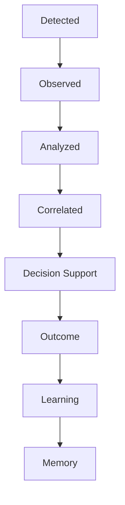
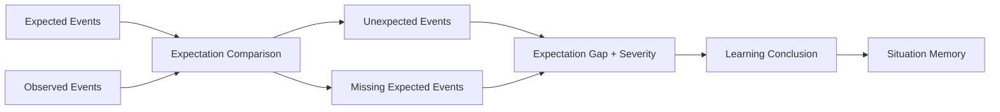

# WR-034 Market Situation Architecture

## Status

Proposed — pending Architecture Review.

## Mission

Whale Radar AI does not generate trading signals. It detects, observes,
evaluates, remembers, and learns complete market situations to improve trader
decision support.

The system must stop treating an isolated transfer, breakout, indicator,
ExpertOpinion, or outcome label as a complete unit of intelligence. Each is an
artifact in the longer history of a `MarketSituation`.

## Context

The architecture already separates Fast and Deep Intelligence. Fast
observations provide early event awareness; normalized observations feed
independent Experts; `ExpertOpinion` values are synthesized into `MarketState`;
Shadow Intelligence permits evaluation without production influence; and
historical foundations can record predictions, outcomes, and learning context.

These artifacts currently have different identities and lifetimes. Without a
shared situation boundary, one underlying event can be fragmented into several
unrelated records, double-counted as confirmation, or learned as isolated
BUY/SELL-style labels. A central domain identity is needed to follow the whole
market story from first detection to memory.

At the `origin/main` baseline for WR-034 (`c2028c1`), Fast Intelligence is
tracked. Correlation is treated in this document as an architectural attachment
point; WR-034 does not assume or integrate an unmerged correlation runtime.
Early Bird is likewise defined here as a future role, not an implemented
engine.

## Decision

Define `MarketSituation` as the primary unit of intelligence and learning in
Whale Radar AI.

A MarketSituation is a long-lived, asset-scoped domain aggregate that relates
the first interesting event, subsequent observations, independent expert
interpretations, correlation evidence, synthesized market state, decision
support context, realized outcome, learning conclusions, and memory references.

It is not:

- a trading signal;
- an order, entry, target, stop, or execution plan;
- a mutable bag owned by one engine;
- a replacement for source, observation, ExpertOpinion, or MarketState
  contracts;
- an assertion that all attached artifacts are independent or correct.

The situation supplies identity, timeline, lifecycle, provenance, and
relationship context. Each attached component retains its own contract and
authority.

## Core principles

1. `MarketSituation` is the primary unit of intelligence.
2. Fast Intelligence detects and attaches early events.
3. Early Bird identifies potentially interesting situations; it does not
   authorize trades.
4. Observations attach normalized facts without interpretation.
5. Experts independently enrich the situation with `ExpertOpinion` values.
6. Correlation describes shared lineage and independence; it does not create
   direction or decisions.
7. `MarketStateEngine` synthesizes opinions; it does not own the situation.
8. Decision Support explains the situation; it does not rewrite its evidence.
9. Outcome records what occurred after the evaluation window.
10. Learning compares complete situations, not isolated indicators or BUY/SELL
    labels.
11. Memory stores situation DNA, outcome, expert behavior, expectation gaps,
    and pattern evolution.
12. No component owns the complete situation. Components own only the artifacts
    they produce.

## Ownership and orchestration

“No component owns the situation” means no Expert, provider, engine, UI,
repository, or learning module may redefine the entire situation from its local
view. A future Situation Orchestrator may coordinate lifecycle transitions and
assemble immutable versions, but it is a steward of the aggregate contract,
not the source of market truth.

| Component | May attach | Must not do |
| --- | --- | --- |
| Fast Intelligence | early event references | confirm scenario or decide trade |
| Early Bird | opportunity/priority/maturity assessment | authorize entry or execution |
| Observation Builders | normalized fact references | interpret or recommend |
| Experts | independent ExpertOpinion references | call/rewrite other Experts |
| Correlation | lineage and independence relationships | manufacture confidence/direction |
| MarketStateEngine | synthesized MarketState reference | own history or sources |
| Decision Support | explanations, readiness context, missing confirmations | erase evidence or execute |
| Outcome | measured post-window facts | rewrite the original expectation |
| Learning | comparison and conclusion | train on only a signal label |
| Memory | versioned situation patterns and references | become an untraceable truth store |

Situation updates should be append-oriented and versioned. Late evidence may
add a new situation version, but must not silently rewrite what the system knew
at an earlier timestamp.

## Market Situation lifecycle

### Detected

One or more Fast Observations indicate that an event is interesting enough to
track. A stable situation ID and first-detected timestamp are established. No
scenario confirmation is implied.

### Observed

Normalized observations add price, structure, momentum, volume, liquidity,
funding, open interest, on-chain, or other facts. Missing and stale data remain
explicit. Observations do not create recommendations.

### Analyzed

Independent Experts evaluate their own evidence axes and attach
`ExpertOpinion` references. Shadow Intelligence and `MarketStateEngine` may
produce a synthesized `MarketState`. Expert disagreement remains visible.

### Correlated

Fast events, observations, and opinions are related to shared underlying event
lineage and time windows. Independence is assessed explicitly so one source
fact cannot masquerade as multiple confirmations.

### Decision Support

The system explains the current situation, confidence, stability, conflicts,
risks, missing confirmations, possible scenarios, and data limitations to a
trader. This stage is decision support, not autonomous trade authorization.

### Outcome

After a defined observation horizon, the situation records what actually
happened: state transitions, price/volatility path, expected and unexpected
events, invalidations, and data quality. Outcome is richer than “won/lost” or
“BUY/SELL correct.”

### Learning

The system compares the full expected-versus-observed trajectory, expert
behavior, correlation, timing, and outcome with analogous situations. It
creates an explainable learning conclusion without automatically modifying
production weights or rules.

### Memory

The completed or still-evolving situation becomes a versioned memory reference.
New situations can retrieve comparable DNA while preserving provenance and
historical knowledge-state timestamps.

The lifecycle is canonical but not a destructive state machine. Late
observations or outcome corrections create new versions and timeline events;
they do not erase prior stages.

## MarketSituation content

The future domain contract should contain or reference the following sections.
Large artifacts remain separate immutable objects and are linked by stable IDs
rather than copied into an ever-growing payload.

### General

- schema version;
- lifecycle stage and stage timestamps;
- created/updated/version timestamps in UTC;
- provenance and correlation identifiers;
- data completeness, freshness, warnings, and access classification;
- parent/superseded situation references when situations merge or split.

### Asset

- canonical asset and instrument scope;
- optional venue/network scope;
- relevant timeframe set;
- asset identity version and aliases used at detection time.

### Timestamp

- first detected time;
- source event times;
- system receive times;
- analysis/evaluation times;
- expectation window;
- outcome window;
- learning and memory timestamps.

Event time and system time must never be conflated.

### Situation ID

A deterministic or otherwise stable, globally unique `situation_id`. Its future
generation policy must support idempotency, situation merge/split history, and
cross-provider deduplication without embedding a trading direction.

### Fast Intelligence

- FastObservation IDs;
- early event types, strengths, qualities, sources, and freshness;
- tentative event context;
- explicit incomplete/missing context.

Fast Intelligence indicates why tracking began, not whether a trade should be
taken.

### Early Bird

- opportunity score;
- priority score;
- maturity score;
- reasons for promoting or continuing observation;
- assessment time and policy version.

### Observations

References to normalized immutable observations grouped by evidence domain,
source, version, asset, timeframe, and observed time. Conflicting, missing,
stale, and unavailable facts remain distinct.

### Experts

References to independent `ExpertOpinion` values, including expert name,
version, input observation references, evaluation timestamp, quality,
confidence, reasons, and warnings. The situation does not overwrite opinion
values.

### Correlation

References describing which fast events, observations, and opinions may share
one underlying event; relevant time windows; shared event references;
correlation score; independence score; and warnings about possible
double-counting.

### MarketState

One or more timestamped `MarketState` references produced by the approved
synthesis authority. Historical states are retained to show how the situation
evolved. `market_maturity` remains a provisional synthesis proxy unless future
structure/correction semantics explicitly replace it.

### Decision Support

- explanation of the active scenarios;
- confidence and Decision Stability context;
- readiness context when available;
- risks, conflicts, missing confirmations, and uncertainty;
- human-facing status and audit policy version.

This section contains no order or execution authority. It must preserve the
distinction between an early alert, deep confirmation, readiness, and a human
decision.

### Outcome

- outcome evaluation window and observed path;
- state changes and significant events;
- whether expectations occurred, failed to occur, or were contradicted;
- invalidations and post-situation data quality;
- context needed to interpret partial or ambiguous outcomes.

### Learning

- expectation analysis;
- comparable situation references;
- expert calibration observations;
- timing and correlation lessons;
- explainable learning conclusion;
- review/approval status for any future policy recommendation.

### Memory references

- Situation DNA version;
- similar and predecessor situation IDs;
- pattern/evolution references;
- expert behavior profiles;
- outcome and expectation-gap references;
- retention, access, and provenance metadata.

## Expectation Analysis

Expectation Analysis compares what the situation led the system to expect with
what the market actually produced. It is not a prediction-score shortcut and
does not convert outcomes into BUY/SELL labels.

### Expected Events

Explicit, timestamped, falsifiable events that were considered plausible during
the situation: for example confirmation structure, volume follow-through,
funding normalization, open-interest expansion/contraction, on-chain flow, or a
state transition. Each expectation records source, rationale, expected window,
confidence, and the situation version that created it.

### Observed Events

Normalized events that actually occurred within or near the expectation window,
including timing, magnitude, quality, source, and links to expectations when a
relationship is explicit.

### Unexpected Events

Observed events that were materially relevant but absent from the expected set,
or that contradicted the expected sequence. They answer explicitly:

> What happened that should not have happened?

Examples include an opposing structure break after high continuation
confidence, volume collapse during an expected expansion, an unanticipated
liquidity shock, or deep evidence reversing while fast evidence appeared to
strengthen. “Should not” means inconsistent with the documented expectation,
not impossible or forbidden by the market.

### Missing Expected Events

Expected events whose window expired without adequate supporting observation.
They answer explicitly:

> What did not happen that should have happened?

Examples include no volume follow-through after a breakout, no OI expansion
during an expected continuation, no confirming structure event, or no expected
funding normalization. Missing data and confirmed non-occurrence must remain
separate.

### Expectation Window

The UTC start/end interval in which an event was expected, with asset/timeframe,
freshness policy, grace period, and evaluation cutoff. A late event is not
silently counted as on-time; it is recorded as late and evaluated separately.

### Expectation Gap

A structured difference between expected and observed trajectories. A gap may
represent contradiction, omission, timing error, magnitude error, sequence
error, or unavailable evidence. The gap links back to the exact expectation and
observations; it is not free-form hindsight.

### Gap Severity

An explainable classification such as `NONE`, `LOW`, `MEDIUM`, `HIGH`, or
`CRITICAL`, based in a future policy on relevance, confidence of the original
expectation, evidence quality, timing deviation, contradiction strength, and
impact on the situation interpretation. Severity is not a trade-loss score and
WR-034 defines no formula or automatic threshold.

### Learning Conclusion

A concise, evidence-linked statement of what should be retained, questioned, or
tested in comparable future situations. It distinguishes source failure,
timing failure, expert overconfidence, missing context, incorrect correlation,
regime change, and genuinely novel market behavior. A conclusion may propose
review; it must not automatically change production logic.

## Early Bird: Opportunity Hunter

Early Bird is a future **Opportunity Hunter**, not a Decision Engine.

Its purpose is to find market situations worth attention and allocate analysis
priority before complete deep context is available. It may promote, defer, or
continue watching a situation. It must not authorize trades, emit execution
instructions, override Expert confidence, or replace Deep Intelligence.

### Opportunity score

How unusual, potentially informative, or worthy of investigation the detected
situation appears. It is not expected return or probability of profit.

### Priority score

How urgently the system should gather or refresh context given freshness,
event speed, source quality, and resource policy. It is not entry urgency.

### Maturity score

How much of the situation context is presently assembled relative to the
tracking workflow. It is not correction completion, trade readiness, or the
`MarketState.market_maturity` proxy.

Scores are bounded, explainable, timestamped, and policy-versioned in a future
contract. No formula or engine is authorized by WR-034.

## Learning model

Learning uses complete MarketSituations as comparison units. It must not learn
from isolated indicators, one Expert score, or BUY/SELL correctness labels.

A learning comparison includes:

- the situation DNA at comparable lifecycle stages;
- fast-detection timing and source quality;
- observation completeness and freshness;
- expert opinions and how they changed;
- correlation and independence assumptions;
- MarketState evolution;
- expectations and their windows;
- observed outcome trajectory;
- expectation gaps and gap severity;
- external regime/context differences;
- what information was actually available at each historical time.

### Situation DNA

Situation DNA is a versioned, explainable feature description for retrieval and
comparison, not an opaque label. It may include event lineage, evidence-domain
presence, timeframe relationships, source agreement, expert configuration,
state transitions, expectation pattern, and outcome shape. It excludes secrets,
raw authenticated payloads, and untraceable derived features.

### Expert behavior

Memory records when each Expert was early, late, stable, conflicted,
overconfident, underconfident, missing, or sensitive to source quality. This
supports calibration review without allowing Experts to rewrite one another.

### Pattern evolution

Patterns are versioned as new situations add evidence. Similarity does not mean
identity, and later outcomes must not leak into the historical features used at
decision time. Pattern evolution records what changed and why.

## Future module attachments

### Funding Expert

Attaches normalized funding observations and an independent crowding/dispersion
opinion. Expectation Analysis can compare expected funding normalization or
extremes with observed behavior. It cannot decide the whole situation.

### Arkham Expert

Attaches normalized on-chain flow observations and opinions with transaction,
entity, freshness, and source provenance. One transfer may seed Fast
Intelligence and later Deep analysis; correlation must prevent double-counting.

### CoinGlass Expert

Attaches provider-neutral derivatives/liquidation observations and opinions
after entitlement and licensing review. Realized liquidations and estimated
heatmap clusters remain distinct. CoinGlass is not a privileged truth source.

### Open Interest Expert

Attaches OI level/change, venue distribution, freshness, and contextual opinion.
Expectation Analysis can identify absent or contradictory OI follow-through.
Missing history remains missing evidence, not neutral confirmation.

### Memory Adapter

Persists and retrieves versioned situation summaries, DNA, outcomes, gaps, and
references without making domain decisions. Storage models must preserve event
time, knowledge time, provenance, schema version, and access/retention policy.

### Decision Stability

Attaches a timestamped robustness assessment explaining consensus, conflict,
quality, freshness, and temporal persistence. Stability is a confidence metric,
not a universal entry blocker or owner of MarketSituation.

### Prediction Review

Attaches post-window review artifacts comparing expectations with observations
and outcome. It evaluates the full situation and information available at the
time, not only whether a target or binary direction label was correct.

### Timeline

Provides a chronological read model of detections, observations, opinions,
state changes, decision-support snapshots, expectations, outcomes, learning,
and memory versions. Timeline is a projection; it must not mutate source
artifacts.

## Situation identity, merge, and split

Two detections for the same asset are not automatically one situation. A future
identity policy considers time windows, shared event references, instrument and
timeframe scope, source lineage, and correlation. When situations merge, both
original IDs and the reason are retained. When one situation splits into
distinct scenarios, the parent reference and split rationale remain visible.

Identity operations never change market direction or confidence by themselves.

## Data and temporal integrity

- all timestamps are timezone-aware UTC;
- event time, receive time, evaluation time, and knowledge time are distinct;
- every attachment records schema and policy version;
- source artifacts are immutable or versioned;
- late evidence creates a new version;
- outcome data cannot leak into earlier Decision Support snapshots;
- missing, neutral, stale, unavailable, conflict, and unexpected remain
  distinct;
- references use stable IDs and preserve source provenance;
- secrets and raw authenticated payloads do not enter Situation DNA or memory.

## Failure behavior

A MarketSituation may remain incomplete. Provider failure, missing Expert,
ambiguous correlation, or absent outcome does not require fabricating a neutral
value. The situation records the limitation and can continue or close with an
incomplete status according to a future retention policy.

## Alternatives considered

### Isolated signal records

Rejected because they fragment context, encourage binary labels, hide timing,
and cannot explain how expectations or expert behavior evolved.

### MarketState as the central object

Rejected because MarketState is one synthesized snapshot. It does not own fast
detection, raw observations, expectation windows, outcomes, learning, or
memory history.

### One mutable object owned by Decision Engine

Rejected because it would let one component overwrite evidence and couple the
entire intelligence lifecycle to trading policy.

### Versioned MarketSituation with independent attachments

Selected because it provides one intelligible lifecycle identity while
preserving component independence, provenance, historical knowledge state, and
future extensibility.

## Consequences

Positive:

- intelligence becomes situation-centric rather than signal-centric;
- early detection, deep analysis, outcome, and learning share one traceable
  history;
- expectation gaps make surprising and missing events learnable;
- double-counting and expert behavior can be reviewed in context;
- memory retrieves comparable situations instead of isolated labels;
- Decision Support can explain what changed over time.

Trade-offs:

- stable identity, merge/split, and versioning policies are non-trivial;
- long-lived situations require retention and privacy governance;
- temporal integrity requires careful event-time/knowledge-time modeling;
- incomplete and late data complicate lifecycle projections;
- similarity and expectation severity require calibration and review;
- a central aggregate increases schema-governance responsibility even though
  components remain independent.

## Implementation sequence (future, not authorized)

1. Approve the MarketSituation contract and lifecycle vocabulary.
2. Define stable identity, version, merge/split, and timeline contracts.
3. Define Early Bird assessment and Expectation Analysis contracts separately.
4. Add a pure Situation Orchestrator in shadow mode.
5. Add a storage-neutral Memory Adapter boundary.
6. Backfill only verified historical artifacts with explicit data gaps.
7. Evaluate complete situations and expectation gaps in shadow learning.
8. Propose production presentation only after calibration and review.

## Scope boundary

WR-034 is documentation only. It does not create a `MarketSituation` class,
Early Bird engine, Situation Orchestrator, expectation engine, correlation
runtime, Expert, Memory Adapter, Decision Stability Engine, Prediction Review
change, timeline, signal, order, execution logic, Telegram integration,
production modification, deployment, or Hostinger change.
