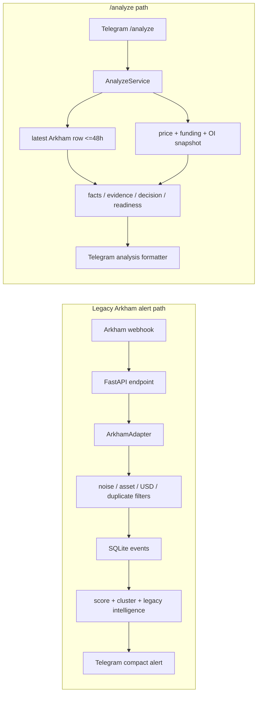
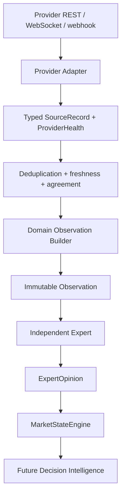

# WR-027A Source Intelligence Architecture & Capability Audit Report

## Status

Completed on `wr-027a-source-intelligence-audit`; pending Architecture Review.
No provider adapter or production behavior was implemented.

## Executive summary

Arkham is often absent from `/analyze` because the checked-in system has no
Arkham pull/history API fallback. It can use only a recent matching SQLite row
that first arrived through a webhook and survived upstream validation. The live
Telegram command requests a 48-hour maximum age. Exact asset matching, missing
alias normalization in the registered adapter, pre-save filters, global
transaction-hash uniqueness, missing hashes, and event expiration all reduce
the chance of a match. Chain is stored but not used in lookup.

The formatter is not the cause: it prints `not found` only when the service
returns no row. Arkham absence does not block `/analyze`, which requires any two
of price, funding, and OI. Absence produces no Arkham fact rather than a neutral
fact.

There is also a critical repository-parity finding: current `origin/main`
cannot import `AnalyzeService` because several referenced decision/snapshot
modules are not tracked. The flow below is therefore verified as checked-in
intent plus individually inspected components; it cannot be claimed to match
the live host until deployment contents are compared safely.

No Arkham, Nansen, or CoinGlass API credential is configured locally. No
authenticated request was attempted. Official documentation confirms all three
can add meaningful capabilities, but entitlement, rate limits, and
redistribution restrictions make provider-neutral typed boundaries mandatory.

## Current Production Source Flow



The two paths share SQLite Arkham history. The new WR-024.5–WR-026B
intelligence foundation is not integrated into either path.

## Exact reasons Arkham is often absent

1. **Webhook-only acquisition in current code.** `app.main.arkham_webhook`
   calls `SourceManager.parse("arkham", payload)` and then the legacy
   `process_event`. No Arkham REST client or historical provider lookup exists.
2. **Payload gate.** `ArkhamAdapter.parse` returns no event without a truthy
   `symbol`/`asset` and `valueUsd`/`amount_usd`.
3. **Pre-save rejection.** `process_event` rejects noise, unsupported assets,
   values below `config_assets.get_min_whale`, duplicates, and save failures.
   Such events cannot be found later.
4. **Alias mismatch.** The registered adapter only uppercases the symbol. The
   separate `arkham_parser.parse_arkham_payload` uses `normalize_asset` for
   WETH/WBTC and other aliases, but `SourceManager` registers `ArkhamAdapter`,
   not that parser.
5. **Exact recent lookup.** `AnalyzeService._load_latest_event` requires exact
   `UPPER(asset)`, source `arkham`, and timestamp after its cutoff. Telegram
   creates the service with 48 hours; other callers default to six.
6. **No chain matching.** Network is stored and returned, but the lookup does
   not filter or normalize chain.
7. **Receipt time instead of event time.** The adapter does not parse the
   provider/block timestamp. `MarketEvent` supplies local construction time,
   which is saved and used for expiration.
8. **Deduplication weakness.** SQLite makes `tx_hash` globally unique instead
   of chain-qualified. Empty hash values can also collide after the first save.
9. **Repository/live uncertainty.** Missing tracked modules prevent local
   reproduction of `/analyze`; deployed database/schema/runtime parity is not
   established.

A valid saved event can be omitted after age expiry or exact-asset mismatch. A
low-score event is saved before the score threshold and can still be selected
by `/analyze`. Formatter logic in `format_analyze_result` only presents the
boolean and is not a filtering cause.

## Relevant files and functions

| File/function | Verified responsibility |
| --- | --- |
| `app/main.py::arkham_webhook` | authenticates incoming request, parses Arkham source, calls legacy pipeline |
| `app/sources/manager.py::SourceManager` | registers and selects `ArkhamAdapter` |
| `app/sources/arkham.py::ArkhamAdapter.parse` | payload gate, substring exchange classification, raw symbol uppercase |
| `app/sources/arkham_parser.py::parse_arkham_payload` | alternate normalized parser used by tests, not registered runtime path |
| `app/engine/filter.py::is_noise_event` | internal exchange and DeFi noise detection |
| `app/engine/pipeline.py::process_event` | supported asset, minimum USD, duplicate, save, score, alert and Telegram path |
| `app/config_assets.py` | supported assets and asset-specific minimum whale values |
| `app/storage/database.py` | SQLite schema, globally unique transaction hash, event persistence |
| `app/storage/history.py` | unaged recent-by-ID history |
| `app/services/analyze_service.py::AnalyzeService` | recent Arkham lookup and intended live snapshot/decision path |
| `app/telegram/polling_bot.py::analyze` | asset normalization, OKX execution selection, 48-hour Arkham cutoff |
| `app/telegram/analyze_formatter.py::format_analyze_result` | displays active/not-found status |
| `app/services/unified_funding_hub.py` | concurrent public funding/price/basis pulls |
| `app/services/unified_open_interest_hub.py` | concurrent public OI pulls |
| `app/domain/perpetual_exchange_registry.py` | execution/hot-backup/intelligence exchange roles |
| `app/intelligence/snapshot_fact_builder.py` | intended Arkham/funding/OI/price fact mapping; OI and price are neutral without deltas |
| `app/decision/trade_readiness_engine.py` | readiness caps and missing liquidation/history/campaign confirmations |
| `app/sources/binance_candle_source.py` | public historical Binance spot klines, not `/analyze`-integrated |

Missing from tracked `origin/main` but imported by this chain:
`app/decision/decision_engine.py`, `app/decision/facts.py`,
`app/intelligence/snapshot_builder.py`, and
`app/intelligence/market_snapshot.py`.

## Current source behavior

| Source | Type/freshness | Matching/fallback/failure | Decision impact |
| --- | --- | --- | --- |
| Arkham alert | push; stored receipt time | webhook only; filters before save; no provider fallback | accepted events drive legacy score/confidence/direction and alert presentation |
| Arkham analyze context | cached historical; 48 h live command | exact asset/source, chain ignored; missing returns `None` | no fact when absent; does not block analysis; large event can raise risk in readiness |
| Funding | live public REST; 24-row history, request-time capture | OKX/Binance/Gate/Bybit, partial failure tolerated | intended directional crowding fact and confidence input |
| OI | live public REST snapshot | four exchanges, partial failure tolerated, no current delta | intended neutral magnitude/concentration facts until delta exists |
| Price/basis | live mark/index values from native funding services | exact builder/selection unavailable in tracked repo | price is required as one of three market blocks; direction remains neutral without delta |
| Liquidations | absent | no collector or cache | always a missing readiness confirmation |

Missing is not neutral. Current `SnapshotFactBuilder` returns no Arkham fact for
an empty block, while OI/price snapshot facts are explicitly neutral pending
historical delta.

## Sanitized credential configuration status

Only variable-name presence was checked; no values or `.env` contents were
read, logged, or included.

```text
ARKHAM_API_KEY: absent
NANSEN_API_KEY: absent
COINGLASS_API_KEY: absent
```

Checked token-name variants were also absent. Authenticated probing was skipped.
A webhook credential is hard-coded in the current source; its value is not
reproduced here. Rotate and externalize it in a separate approved security task.

## Capability matrix

Full evidence and operational detail are in
[`WR-027A-source-intelligence-capability-audit.md`](../specs/WR-027A-source-intelligence-capability-audit.md).

| Capability | Arkham | Nansen | CoinGlass | Native code |
| --- | --- | --- | --- | --- |
| transfers/entity flow | `VERIFIED_AVAILABLE` | `VERIFIED_AVAILABLE` | `VERIFIED_AVAILABLE` selected endpoints | `NOT_APPLICABLE` |
| wallet/entity labels | `VERIFIED_AVAILABLE` | `VERIFIED_AVAILABLE` / `PLAN_DEPENDENT` | `DOCUMENTATION_REQUIRED` | `NOT_APPLICABLE` |
| smart money | `DOCUMENTATION_REQUIRED` taxonomy | `VERIFIED_AVAILABLE` / `PLAN_DEPENDENT` | `DOCUMENTATION_REQUIRED` | `NOT_APPLICABLE` |
| historical lookup | `VERIFIED_AVAILABLE` | `VERIFIED_AVAILABLE` with endpoint retention | `VERIFIED_AVAILABLE` | funding and candles `VERIFIED_AVAILABLE`; OI snapshot only |
| push/stream | transfer WebSocket `VERIFIED_AVAILABLE`; webhook docs required | `DOCUMENTATION_REQUIRED` | liquidation WebSocket `VERIFIED_AVAILABLE` | current repo pull only |
| funding / OI / basis | `NOT_APPLICABLE` | `DOCUMENTATION_REQUIRED` broad market | `VERIFIED_AVAILABLE` | `VERIFIED_AVAILABLE` |
| liquidation events | `NOT_APPLICABLE` | `DOCUMENTATION_REQUIRED` | `VERIFIED_AVAILABLE` | not implemented |
| liquidation heatmap | `NOT_APPLICABLE` | `DOCUMENTATION_REQUIRED` | `VERIFIED_AVAILABLE` | `NOT_APPLICABLE` |
| long/short ratios | `NOT_APPLICABLE` | `DOCUMENTATION_REQUIRED` | `VERIFIED_AVAILABLE` | not implemented |
| options / ETF | `NOT_APPLICABLE` or docs required | `DOCUMENTATION_REQUIRED` | `VERIFIED_AVAILABLE` | not implemented |
| entitlement/rate | `PLAN_DEPENDENT`; heavy endpoints limited | credit/tier `PLAN_DEPENDENT` | plan/rate `PLAN_DEPENDENT` | current endpoints public; provider-specific limits |
| redistribution | subscription review required | endpoint-specific allowed/restricted/prohibited | plan/terms review required | exchange-by-exchange review required |

Official evidence:

- [Arkham API and transfer/WebSocket documentation](https://docs.intel.arkm.com/openapi/transfers)
- [Nansen endpoint overview](https://docs.nansen.ai/api/overview) and
  [redistribution guide](https://docs.nansen.ai/guides/redistribution-guide)
- [CoinGlass endpoint overview](https://docs.coinglass.com/reference/endpoint-overview),
  [WebSocket](https://docs.coinglass.com/reference/ws-getting-started), and
  [rate limits](https://docs.coinglass.com/reference/responses-error-codes)

## Data-overlap analysis

Arkham and Nansen overlap on transfers, entity/address labeling, balances, and
flows. Their records must be deduplicated by `(chain, tx_hash)` before agreement
is scored. Label agreement raises confidence; label disagreement remains two
provider assertions with a warning. Absence from either provider is not a
contradiction.

CoinGlass overlaps native exchanges on funding, OI, basis, and liquidations.
Native data is execution-market ground truth for its own venue and timestamp;
CoinGlass provides normalized cross-exchange coverage and dispersion. Compare
same instrument/window/unit before measuring disagreement. A stale aggregate
cannot override a fresh native record.

## Provider-neutral target architecture



The immutable source envelope contains provider, record type, normalized asset,
event and receive timestamps, source ID, quality, payload version, a typed body,
and sanitized metadata. Typed record families separate transfers, wallet labels,
derivatives, realized liquidations, and estimated liquidity. A universal raw
dictionary is prohibited.

`ProviderHealth` reports healthy/degraded/stale/rate-limited/unavailable state,
last success, latency, freshness, sanitized error category, and non-secret
rate-limit state. Health is never market direction.

## Proposed observations

- `OnChainFlowObservation`: confirmed exchange inflow/outflow, entity category,
  transfer value/direction, chain, source agreement, freshness, quality. No
  inferred intent.
- `WalletIntelligenceObservation`: smart-money class, wallet/entity labels,
  historical behavior, optional realized/unrealized context, source confidence,
  freshness, quality. Labels are not ground truth.
- `DerivativesObservation`: funding, OI and delta, long/short ratios, basis,
  exchange dispersion, freshness, quality. No liquidation conflation.
- `LiquidationObservation`: explicit `REALIZED` or `ESTIMATED_CLUSTER` kind,
  side, magnitude, distance, confidence and provider/model. The kinds must not
  be summed or described as equally confirmed.

## Proposed experts

| Expert | Accepts | Responsibility | Prohibited |
| --- | --- | --- | --- |
| `OnChainFlowExpert` | On-chain flow observations | exchange/entity flow opinion | providers, wallet intent, trading action |
| `WalletIntelligenceExpert` | wallet observations | behavior/label evidence opinion | labels as truth, duplicate flow counting |
| `DerivativesExpert` | derivatives observations | leverage/crowding/basis/dispersion opinion | on-chain identity, heatmaps |
| `LiquidationExpert` | liquidation observations | realized stress and estimated proximity, kept distinct | inferred clusters as executed events |
| `NarrativeExpert` | future normalized narrative observations | corroborated narrative context | raw provider calls, invented facts, market override |

Every Expert emits `ExpertOpinion` to MarketStateEngine, imports no provider,
and does not call another Expert.

## Deduplication strategy

- confirmed transaction: `(normalized_chain, transaction_hash)`;
- provider source IDs: within-provider idempotency only;
- missing hash: retain separately; optional fingerprint is low-confidence and
  must not silently merge providers;
- derivatives: provider + exchange + instrument + metric + observed interval;
- realized liquidation: exchange event/order ID when present, otherwise strict
  venue/instrument/time/side/price/quantity fingerprint;
- heatmap: provider + model/version + instrument + as-of time + price band;
- preserve provenance set and do not count the same chain event twice.

## Freshness strategy

Use provider event time for inference and receive time for latency. Proposed
fresh/stale limits are: realized liquidations 30 s/2 min; price/funding/OI
60 s/5 min; heatmap 5/15 min; immediate transfer 15 min/6 h; historical transfer
6/48 h; labels 24 h/7 d. Beyond stale-usable is unavailable for new inference.
Cache reads never reset event age.

## Source precedence strategy

Native venue data wins for its execution market when fresher. CoinGlass supplies
aggregate/cross-exchange context. Arkham and Nansen remain peer assertions for
chain events and labels; agreement affects quality only after deduplication.
Quality uses completeness, freshness, health, identifier strength, label
confidence, and agreement—not direction or subscription price.

## Failure/fallback strategy

Typed states distinguish `NEUTRAL`, `MISSING`, `STALE`, `UNAVAILABLE`, and
`RATE_LIMITED`. Fallback is fresh primary, fresh corroborator, eligible marked
stale cache, then missing/unavailable. Partial outage only degrades affected
capabilities. Authentication, entitlement, validation, timeout, rate limit,
provider error, and schema/version errors are separately categorized without
raw private payloads.

## Security considerations

- rotate/externalize the current hard-coded webhook credential;
- read-only least-privilege provider credentials in environment/vault;
- never log keys, headers, cookies, webhook secrets, or private bodies;
- retain minimum normalized facts rather than raw authenticated payloads;
- verify webhook authenticity and replay resistance;
- use short timeouts, bounded retries, circuit breakers and rate accounting;
- sanitize fixtures and error telemetry;
- qualify transaction identity by chain.

No secret value was written to this report or staged.

## Data licensing questions

- Arkham: permitted retention, label/flow derivation, Telegram/customer-facing
  display, attribution, and private-label handling under actual subscription.
- Nansen: endpoint-specific redistribution class; Smart Money/label data may be
  restricted or prohibited and needs written review for the intended output.
- CoinGlass: raw/normalized retention, heatmap derivation, redistribution,
  attribution, and plan entitlement.
- Native exchanges: aggregation, caching, historical retention, and derived
  redistribution terms per venue.

## Arkham Options A/B/C

| Option | Scope | Benefit | Complexity/latency/API/storage | Failure modes | Phase |
| --- | --- | --- | --- | --- | --- |
| A | Fix webhook normalization, event time, chain+hash identity, rejection telemetry and lookup diagnostics | fastest reduction of `not found`, best explainability | low–medium; no private API; small migration likely | payload drift, migration errors, noisy telemetry | first |
| B | Private `/transfers` pull fallback on missing recent cache | fills webhook gaps, deterministic recent lookup | medium; entitlement/credits, heavy 1 rps, bounded added latency, normalized cache | auth/plan/429, stale response, duplicate pull/push | after source contracts |
| C | entity/counterparty/flow/history campaign intelligence | richer institutional context | high; multiple endpoints, credits and aggregation storage | label revisions, over-narration, double count, licensing | later shadow research |

## Recommended implementation order

0. Restore repository/deployment parity for `/analyze`.
1. Current Arkham diagnosis/fix — Option A.
2. Pure SourceRecord/ProviderHealth/freshness contracts.
3. Normalize the existing native exchange candle adapter path.
4. Add CoinGlass derivatives adapter in shadow mode.
5. Build DerivativesObservation/Expert.
6. Add Arkham private pull fallback — Option B.
7. Build OnChainFlowObservation/Expert.
8. Add Nansen wallet-intelligence adapter after entitlement/licensing approval.
9. Integrate the new intelligence foundation into production in shadow mode,
   then review measured behavior before any decision influence.

The first provider task is Arkham Option A. The first new provider should be
CoinGlass because it fills the current liquidation/aggregate derivatives gap,
but only after provider-neutral contracts and plan/legal confirmation.

## Proposed next WR tasks

- WR-027B: repository/deployment parity plus Arkham matching and observability
  hardening (scope must be separately approved).
- WR-027C: immutable source records, provider health, freshness, and error
  contracts.
- WR-027D: normalized native candle/market record adapter and builder boundary.
- WR-027E: CoinGlass read-only shadow adapter and fixtures.
- Later: Derivatives Expert, Arkham pull fallback, OnChainFlow Expert, Nansen
  wallet intelligence, then shadow production integration.

No next task is started automatically.

## Files changed

- `docs/architecture/adr/ADR-WR-027A-source-intelligence-architecture.md`
- `docs/specs/WR-027A-source-intelligence-capability-audit.md`
- `docs/reports/WR-027A_REPORT.md`

No production Python or dependency file changed.

## Tests and checks

The task is documentation-only.

| Check | Result |
| --- | --- |
| repository baseline, tag, prior WR ancestry | PASS |
| tracked working tree before work | PASS; only previously known untracked WR-026C/archive files existed |
| sanitized provider credential-name presence | PASS; requested API keys absent, no values read |
| official provider documentation review | PASS; Arkham, Nansen and CoinGlass primary docs used |
| local `/analyze` import diagnostic | expected baseline failure; missing tracked modules recorded as audit finding |
| relative documentation links | PASS |
| `git diff --cached --check` | PASS |
| staged secret-pattern and known webhook-value scan | PASS; none found |
| staged `.env`, requirements, app, archive check | PASS; none staged |
| staged scope | PASS; exactly three WR-027A documents |
| production/Telegram/database/API diff | PASS; none changed |
| full staged diff review | PASS |

## Production impact

None. Telegram, webhook, database, services, adapters, deployment, requirements,
and runtime behavior are unchanged. No network provider call was made.

## Git information

- Branch: `wr-027a-source-intelligence-audit`
- Base: `origin/main` `0810c341e63d64b17537313face75dd686571015`
- Base tag: `v0.8-first-expert`
- Planned commit: `WR-027A add source intelligence architecture`
- Merge: prohibited pending Architecture Review

Pre-commit full branch/staged diff:

```text
3 files changed, 992 insertions(+)
A docs/architecture/adr/ADR-WR-027A-source-intelligence-architecture.md
A docs/reports/WR-027A_REPORT.md
A docs/specs/WR-027A-source-intelligence-capability-audit.md
```

## Open questions requiring user input

1. Can the deployed Hostinger file manifest/commit and schema be compared
   read-only with `origin/main` to resolve `/analyze` parity?
2. Is the intended Telegram audience internal/personal or customer-facing? This
   changes Nansen and possibly other redistribution obligations.
3. Which provider plans/entitlements are actually owned or budgeted?
4. Is Arkham API access available under a trial, Exchange entitlement, or a
   separate contract?
5. What retention period is acceptable for normalized provider facts?
6. Should the next approved task combine repository parity with Arkham Option A,
   or treat parity as a separate security/correctness task?

## Architecture decision

See
[`ADR-WR-027A-source-intelligence-architecture.md`](../architecture/adr/ADR-WR-027A-source-intelligence-architecture.md).
Architecture Review is required before merge or any adapter implementation.
