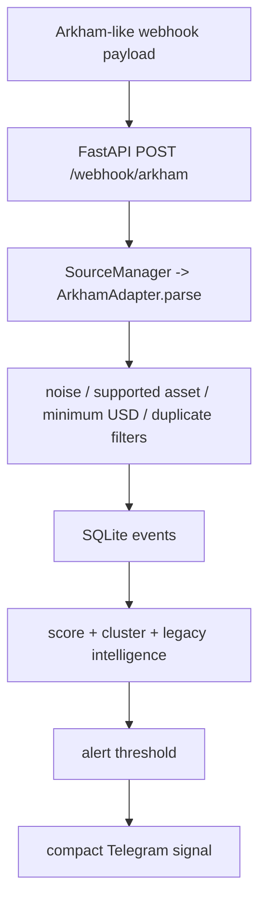
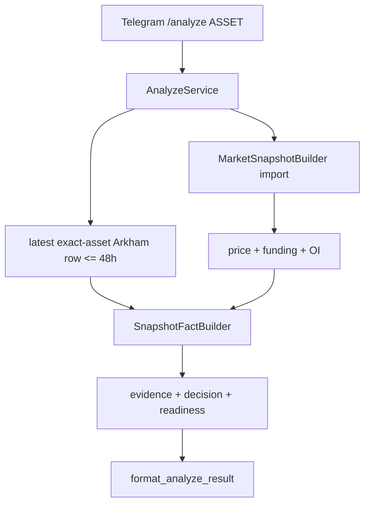

# WR-027A — Source Intelligence Capability Audit Specification

## Status and scope

Architecture/capability audit based on `origin/main` at
`0810c341e63d64b17537313face75dd686571015` (`v0.8-first-expert`) and official
provider documentation accessed 2026-07-14. This task creates documentation
only. It does not implement or probe authenticated adapters.

## Status vocabulary

- `VERIFIED_AVAILABLE` — verified in checked-in code or official provider docs.
- `VERIFIED_UNAVAILABLE` — official documentation explicitly says unavailable.
- `PLAN_DEPENDENT` — endpoint/capacity depends on entitlement or credits.
- `DOCUMENTATION_REQUIRED` — not established by inspected official material.
- `NOT_APPLICABLE` — outside the provider/domain's relevant product category.
- `UNKNOWN` — insufficient evidence.

`VERIFIED_AVAILABLE` describes provider documentation, not the current account's
entitlement. No provider credential was present, so no authenticated capability
was tested.

## Current production source flow

### Arkham alert path

### `/analyze` path expressed by checked-in code

The second path is an intended flow, not locally reproducible from
`origin/main`: `app.decision.decision_engine`, `app.decision.facts`,
`app.intelligence.snapshot_builder`, and `app.intelligence.market_snapshot` are
imported but not tracked. Importing `app.services.analyze_service` fails at the
first missing module. The live deployment may contain additional files, but
that cannot be inferred from this repository.

## Current source inventory

| Source | Entry/source type | Freshness and match | Fallback/failure | Current decision use |
| --- | --- | --- | --- | --- |
| Arkham webhook | `app.main.arkham_webhook`; push | Adapter requires symbol and USD value. Receipt time is stored; provider event time is ignored. | Invalid payload returns an error result; later filters may ignore. No pull fallback. | Drives the legacy event score/alert path when accepted. |
| Stored Arkham for `/analyze` | `AnalyzeService._load_latest_event`; cached historical | Exact uppercased asset, source `arkham`, newest row, 48 h from Telegram caller (6 h default elsewhere); chain not matched. | Returns `None`; analysis only requires two of price/funding/OI. | Produces no Arkham fact when absent. Exact downstream numeric effect cannot be reproduced because required modules are missing. |
| Funding | `UnifiedFundingHubService`; REST pull | OKX, Binance, Gate.io, Bybit; request-time capture, 12 s default timeout, 24 history rows. | Per-exchange errors retained; registry selects available execution set; all missing -> unavailable. | Intended `/analyze` input and separately exposed `/funding`; marked read-only/no automatic execution. |
| Open interest | `UnifiedOpenInterestHubService`; REST pull | OKX, Binance, Gate.io, Bybit current snapshots; 12 s timeout. | Partial exchange failures retained; all missing -> unavailable. | Intended `/analyze`; current `SnapshotFactBuilder` treats OI snapshot as neutral until delta exists. |
| Price/basis | Native funding services; REST pull | Mark/index/basis captured with funding. Binance spot candle source also supports historical klines but is not wired to `/analyze`. | Per-exchange failure; exact snapshot selection is in missing `MarketSnapshotBuilder`. | Price is one of the three blocks required by `AnalyzeService`; exact construction cannot be verified. |
| Liquidations | No collector | None. | Always absent from source layer. | `TradeReadinessEngine` expects liquidation confirmation and lists it missing when absent. |
| Database/history | SQLite `events`; cached | No retention job found. History command is latest-by-ID without age. | SQLite failures propagate or save returns false on integrity conflict. | Supports legacy context/history and recent Arkham lookup. |

Exchange registry roles are OKX/Binance/Gate as execution, Bybit as hot backup,
and Bitget/Hyperliquid/Deribit/Coinbase/Kraken as intelligence candidates. Only
the first four are wired in current funding and OI hubs.

## Exact Arkham absence diagnosis

`Arkham Event: not found` is emitted only when
`result["arkham_event_found"]` is false. That boolean is the result of
`AnalyzeService._load_latest_event`; the formatter does not perform a second
lookup or filtering step.

A row is absent from the lookup when any of these verified conditions holds:

1. No webhook was received and accepted; there is no historical API fallback.
2. `ArkhamAdapter.parse` rejected a payload without a truthy `symbol`/`asset` or
   USD value.
3. The legacy pipeline rejected it as noise, unsupported asset, below the
   asset-specific minimum whale threshold, duplicate, or save failure before it
   became a usable row.
4. The registered adapter uppercases but does not run the repository's alias
   normalizer. Thus aliases such as wrapped assets remain distinct and can fail
   the supported-asset filter or exact `/analyze` asset match. The separate
   `arkham_parser.py` does normalize aliases but is not registered by
   `SourceManager`.
5. The stored row is older than 48 hours for the Telegram `/analyze` caller.
   The service default is six hours. A valid event can therefore expire before
   analysis.
6. Asset match is exact after `UPPER(asset)`; chain is not part of the query.
7. `tx_hash` is globally unique rather than `(chain, tx_hash)`. When the adapter
   supplies an empty hash, the first empty value can be stored and subsequent
   empty hashes collide under the SQLite unique constraint.
8. Repository/deployment parity is unknown; the checked-in `/analyze` service
   cannot import, so live database location/schema and runtime files cannot be
   validated here.

The event timestamp is the local `MarketEvent` construction time because the
registered adapter does not parse provider event time. Therefore the current
age check measures receipt/storage age, not confirmed blockchain observation
age.

A stored event may still be excluded from `/analyze` after expiration or due to
exact asset mismatch. Conversely, the load query does not reapply minimum USD,
noise, or event-type filters; a directly inserted recent row could be loaded.
Low-score events are saved before the score threshold and can be found later.

## Sanitized private configuration audit

Only name presence was checked in the process environment and `.env`; values
were not read or printed.

| Variable | Status |
| --- | --- |
| `ARKHAM_API_KEY` | absent |
| `NANSEN_API_KEY` | absent |
| `COINGLASS_API_KEY` | absent |

Checked token-name variants were also absent. No authenticated request was made.
The repository currently uses a hard-coded webhook credential in `app/main.py`;
its value is intentionally omitted. It requires a separate rotation and
environment/vault migration task.

## Provider capability matrix

### Core on-chain and delivery capabilities

| Capability | Arkham | Nansen | CoinGlass | Existing native exchange code |
| --- | --- | --- | --- | --- |
| Principal categories | `VERIFIED_AVAILABLE` on-chain entities, transfers, balances, flow | `VERIFIED_AVAILABLE` wallet, labels, smart money, token/exchange flow | `VERIFIED_AVAILABLE` derivatives, spot, options, ETF, selected on-chain | `VERIFIED_AVAILABLE` funding, OI, price/basis, Binance spot candles |
| Push/stream | `VERIFIED_AVAILABLE` transfer WebSocket; current webhook provenance `DOCUMENTATION_REQUIRED` | `DOCUMENTATION_REQUIRED` (inspected API is REST POST) | `VERIFIED_AVAILABLE` WebSocket liquidation orders | `DOCUMENTATION_REQUIRED`; current repo uses REST pull only |
| Historical lookup | `VERIFIED_AVAILABLE` transfers, history, portfolio/time series | `VERIFIED_AVAILABLE` balances, transfers, holdings subject endpoint retention | `VERIFIED_AVAILABLE` market histories | `VERIFIED_AVAILABLE` funding history and Binance klines; current OI hub is snapshot only |
| Wallet labels | `VERIFIED_AVAILABLE` address/entity intelligence and user labels | `VERIFIED_AVAILABLE`; premium labels `PLAN_DEPENDENT` | `DOCUMENTATION_REQUIRED` | `NOT_APPLICABLE` |
| Entity labels | `VERIFIED_AVAILABLE` | `VERIFIED_AVAILABLE` | `DOCUMENTATION_REQUIRED` | `NOT_APPLICABLE` |
| Transfers | `VERIFIED_AVAILABLE` REST and WebSocket | `VERIFIED_AVAILABLE` | `VERIFIED_AVAILABLE` whale/exchange ERC-20 endpoints | `NOT_APPLICABLE` |
| Exchange inflow/outflow | `VERIFIED_AVAILABLE` token/exchange movement and flow filters | `VERIFIED_AVAILABLE` TGM flows/flow intelligence | `VERIFIED_AVAILABLE` spot netflow and exchange chain transactions | `NOT_APPLICABLE` |
| Smart-money labels | `DOCUMENTATION_REQUIRED` as a distinct taxonomy | `VERIFIED_AVAILABLE`; access/redistribution `PLAN_DEPENDENT` | `DOCUMENTATION_REQUIRED` | `NOT_APPLICABLE` |
| Token flows | `VERIFIED_AVAILABLE` | `VERIFIED_AVAILABLE` | `VERIFIED_AVAILABLE` | `NOT_APPLICABLE` |
| Supported chains/exchanges | `VERIFIED_AVAILABLE` via chains endpoint; entitlement not tested | `VERIFIED_AVAILABLE`, endpoint-specific multi-chain coverage | `VERIFIED_AVAILABLE` supported exchanges/pairs endpoints | `VERIFIED_AVAILABLE` local OKX/Binance/Gate/Bybit; broader registry not wired |

### Derivatives and institutional-market capabilities

| Capability | Arkham | Nansen | CoinGlass | Existing native exchange code |
| --- | --- | --- | --- | --- |
| Funding | `NOT_APPLICABLE` | `DOCUMENTATION_REQUIRED` for broad market funding | `VERIFIED_AVAILABLE` | `VERIFIED_AVAILABLE` four exchanges |
| Open interest | `NOT_APPLICABLE` | `DOCUMENTATION_REQUIRED` for broad market OI | `VERIFIED_AVAILABLE` | `VERIFIED_AVAILABLE` four exchanges |
| Realized liquidations | `NOT_APPLICABLE` | `DOCUMENTATION_REQUIRED`; perp positions expose liquidation prices, not verified events | `VERIFIED_AVAILABLE` REST and WebSocket events | `DOCUMENTATION_REQUIRED`; not implemented |
| Estimated liquidation heatmap | `NOT_APPLICABLE` | `DOCUMENTATION_REQUIRED` | `VERIFIED_AVAILABLE` multiple models/maps | `NOT_APPLICABLE` in current code |
| Long/short ratios | `NOT_APPLICABLE` | `DOCUMENTATION_REQUIRED` | `VERIFIED_AVAILABLE` | `DOCUMENTATION_REQUIRED`; not implemented |
| Basis | `NOT_APPLICABLE` | `DOCUMENTATION_REQUIRED` | `VERIFIED_AVAILABLE` | `VERIFIED_AVAILABLE` mark/index basis in funding services |
| Options | `NOT_APPLICABLE` | `DOCUMENTATION_REQUIRED` | `VERIFIED_AVAILABLE` | `DOCUMENTATION_REQUIRED`; registry mentions Deribit but no adapter |
| ETF data | `DOCUMENTATION_REQUIRED` as data product | `DOCUMENTATION_REQUIRED` | `VERIFIED_AVAILABLE` | `NOT_APPLICABLE` |

### Operations, freshness, entitlement, and licensing

| Provider | Polling/freshness | Rate-limit considerations | Plan/entitlement | Storage/licensing |
| --- | --- | --- | --- | --- |
| Arkham | REST can poll by event time; WebSocket available. `/transfers` is heavy. | Official docs state 1 request/s for heavy endpoints and tiered standard limits; WebSocket sessions/transfers consume credits. | `PLAN_DEPENDENT`; API access/key required. | `DOCUMENTATION_REQUIRED` against subscription/TOS before retaining labels or private data. |
| Nansen | Many endpoints described as seconds/near-real-time, but freshness varies and endpoint retention differs. | Official current guide states 20 requests/s and 300/min plus credit consumption. | `PLAN_DEPENDENT`; premium labels and Smart Money are higher-cost/restricted. | Endpoint-specific: some allowed, some require attribution/approval and transformation, some prohibit redistribution. Legal/product review required. |
| CoinGlass | REST endpoint cache intervals vary; liquidation WebSocket is available. Poll no faster than documented cache. | Rate limits and headers are plan-dependent; handle 429 and remaining/capacity metadata. | `PLAN_DEPENDENT`; no local key/entitlement verified. | `DOCUMENTATION_REQUIRED` before storage or customer-facing redistribution. |
| Native APIs | Current calls are request-time public REST, 12–15 s timeout; no shared TTL/cache. | Provider-specific limits are not centralized or surfaced by current code. | Current implemented endpoints require no private key. | Exchange terms require per-provider review before persistent redistribution. |

## Official documentation evidence

- Arkham: [API guide](https://arkm.com/api/docs) and
  [transfer/WebSocket reference](https://docs.intel.arkm.com/openapi/transfers).
  The reference documents transfer/history/entity/balance/flow capabilities,
  transfer WebSocket, API-key access, and heavy endpoint limits.
- Nansen: [endpoint overview](https://docs.nansen.ai/api/overview),
  [supported chains](https://docs.nansen.ai/reference/chains),
  [rate limits](https://docs.nansen.ai/getting-started/rate-limits),
  [credits](https://docs.nansen.ai/getting-started/credits), and
  [redistribution guide](https://docs.nansen.ai/guides/redistribution-guide).
- CoinGlass: [endpoint overview](https://docs.coinglass.com/reference/endpoint-overview),
  [WebSocket guide](https://docs.coinglass.com/reference/ws-getting-started),
  and [rate-limit/error guide](https://docs.coinglass.com/reference/responses-error-codes).

Provider documentation changes over time. Recheck capabilities, plan, and legal
terms immediately before implementation.

## Provider-neutral interfaces

The normative architecture is defined in
[`ADR-WR-027A-source-intelligence-architecture.md`](../architecture/adr/ADR-WR-027A-source-intelligence-architecture.md).
Future implementations must use frozen typed records and explicit enums for
capability, record kind, health, error category, and freshness state. A bounded
sanitized metadata mapping may carry provenance extensions, but cannot replace
the typed body.

## Source agreement, precedence, and fallback

1. Normalize asset, chain, instrument, event time, and provider identity.
2. Deduplicate confirmed chain events by `(chain, tx_hash)` before aggregation.
3. Preserve each provider assertion and label confidence.
4. Agreement may raise source confidence; disagreement adds warnings. Missing
   evidence is not contradiction.
5. For an execution exchange, its native fresh record wins for that market.
   CoinGlass aggregate supplies cross-market context and dispersion.
6. A stale aggregate cannot override fresh native data.
7. Fallback is fresh primary -> fresh corroborator -> eligible marked-stale
   cache -> missing/unavailable.
8. Partial outage degrades only affected capabilities. Rate limiting is a health
   state, not neutral market evidence.
9. Cached records retain event time and provenance and cannot be silently
   relabeled current.

## Proposed observations and experts

| Observation | Normalized contents | Expert | Expert output/prohibitions |
| --- | --- | --- | --- |
| `OnChainFlowObservation` | confirmed exchange flow, entity category, transfer value/direction, chain, agreement, freshness, quality | `OnChainFlowExpert` | Directional flow opinion; no intent narrative, provider import, or trade action. |
| `WalletIntelligenceObservation` | smart-money class, labels, behavior history, optional realized/unrealized context, source confidence | `WalletIntelligenceExpert` | Wallet-behavior opinion; labels remain probabilistic and transfers are not double-counted. |
| `DerivativesObservation` | funding, OI/delta, ratios, basis, dispersion, freshness, quality | `DerivativesExpert` | Crowding/leverage opinion; no on-chain identity or heatmap interpretation. |
| `LiquidationObservation` | explicit realized-event or estimated-cluster kind, side, magnitude, distance, confidence, model/provider | `LiquidationExpert` | Stress/proximity opinion; estimated clusters never presented as realized. |
| future narrative observation | normalized claims, source set, time and corroboration | `NarrativeExpert` | Corroborated context only; no invented facts or direct market override. |

All Experts emit `ExpertOpinion` to MarketStateEngine and do not call each other.

## Arkham implementation options

| Option | Scope and benefit | Complexity/latency/API/storage | Failure modes | Recommended phase |
| --- | --- | --- | --- | --- |
| A — matching/history hardening | Normalize aliases/entities, parse event time, chain-qualified identity, rejection metrics, lookup diagnostics, tests. Highest immediate explanation value. | Low–medium; no private API; webhook latency unchanged; small schema migration likely. | Bad payload variants, migration/dedup errors, misleading telemetry. | First. |
| B — private pull fallback | Typed Arkham REST adapter queries transfers when recent cache is missing; bounded timeout, entitlement health, cache. | Medium; API/credits and 1 request/s heavy limit; adds controlled request latency and normalized cache. | 401/403/429, stale results, cost exhaustion, duplicate webhook/pull records. | After source contracts and entitlement/legal confirmation. |
| C — campaign/entity-flow intelligence | Counterparties, entity/address flow, history and portfolio into campaign observations. Richer institutional context. | High; multiple endpoints/credits; aggregation storage and longer analytical latency. | label revisions, narrative overreach, double counting, entitlement/cost, licensing. | Later research/shadow phase. |

## Evidence-based implementation order

| Order | Work | Immediate value | Cost/risk and rationale |
| ---: | --- | --- | --- |
| 0 | Restore repository/deployment parity for `/analyze` | Enables reproducible tests and trustworthy audit | Blocking correctness task; no provider spend. |
| 1 | Current Arkham matching diagnosis/fix (Option A) | Directly reduces unexplained `not found`; improves current Telegram evidence | Low provider risk, high explainability, fully fixture-testable. |
| 2 | Pure source contracts/health/freshness | Prevents provider coupling before adapters | Architectural prerequisite; no live impact. |
| 3 | Native exchange candle adapter normalization | Gives deterministic trend input from a source already present | Low cost/public API; current Binance source exists but needs normalized boundary and shadow tests. |
| 4 | CoinGlass derivatives adapter | Adds liquidation, aggregate OI/funding/ratio context missing today | High immediate derivatives value but plan/rate/license dependent; start read-only shadow. |
| 5 | Derivatives Expert | Converts normalized native/CoinGlass facts without provider binding | Explainable and testable after records/builders. |
| 6 | Arkham private pull adapter (Option B) | Fills webhook gaps and supports recent history | API credits/rate limits/latency; only after Option A and contracts. |
| 7 | OnChainFlow Expert | Uses deduplicated Arkham/Nansen-ready observations | Valuable after reliable normalized flow exists. |
| 8 | Nansen wallet-intelligence adapter | Unique labels, behavior and smart-money context | Highest entitlement and redistribution sensitivity; avoid early lock-in. |
| 9 | Production intelligence integration | Improves Telegram decisions | Last, shadow-first, with health/fallback and no automatic trading impact. |

The first provider-facing task is still Option A: harden current Arkham webhook
matching and observability before paying for another data source. CoinGlass is
the recommended first *new* provider after contracts and native normalization.

## Security requirements

- no credentials, authorization headers, cookies, private raw responses, or
  webhook secrets in logs, records, metadata, tests, reports, or Git;
- read-only least-privilege keys from environment/vault, never constants;
- short timeout, bounded retry/backoff, circuit breaker and rate-limit handling;
- sanitized error categories and metrics;
- no raw authenticated payload persistence by default;
- webhook signature/secret rotation and replay protection;
- chain-qualified deduplication and explicit payload versions;
- fixture responses synthetic or fully sanitized.

## Data licensing questions requiring confirmation

1. May Arkham labels, transfers, and derived entity flows be persisted, and for
   how long? May derived Telegram output be customer-facing?
2. Which Nansen endpoints are internal-only, attribution-required, restricted,
   or prohibited for the intended Telegram audience?
3. Does CoinGlass permit storage of raw/normalized history, redistribution, and
   derived alerts under the intended plan?
4. Do native exchange API terms allow aggregation and persisted redistribution?
5. What data deletion, audit, regional, and user-access requirements apply?

## Acceptance and verification

- complete current source flow with file/function evidence;
- exact Arkham absence diagnosis with uncertainty clearly bounded;
- sanitized credential status only;
- provider matrix using required status vocabulary and official sources;
- typed provider-neutral target, observation/expert boundaries, agreement,
  freshness, precedence and fallback rules;
- Options A/B/C and ordered roadmap;
- no production code, Telegram, `.env`, requirements, secrets, adapters, or
  dependency changes;
- documentation links, staged secret scan, `git diff --check`, scope and full
  branch diff review pass.

Production integration and WR-027B are explicitly out of scope.
